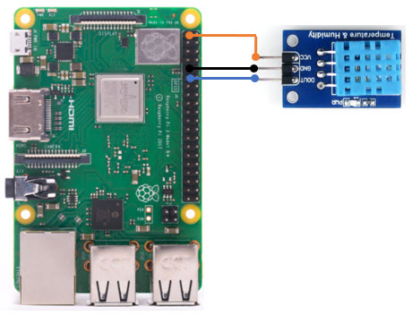

# home-dungeonHumidity
DHT11 Temperature and Humidity Sensor

Also takes a picture of the de-humidifier and processes the image to discover error LEDs.

# Schematic



# Links

I bought from amazon:<br>
https://www.amazon.com/gp/product/B079NJ64RV

The board I bought is essentially a DHT11 module with a pullup resistor and a cap:<br>
https://www.mouser.com/ds/2/758/DHT11-Technical-Data-Sheet-Translated-Version-1143054.pdf

The datasheet describes the one-wire, two-way serial communication protocol.

Adafruit sells the raw DHT11 modules, and they have lots of tutorials and libraries:<br>
https://www.adafruit.com/product/386

The sensor requires a hybrid serial interfce -- you cannot use the built in serial port.
Adafruit made a nice Python library that includes a C module for the I/O:<br>
https://github.com/adafruit/Adafruit_Python_DHT

Great tutorial. It even mentions success on the Pi Zero:<br>
https://www.raspberrypi-spy.co.uk/2017/09/dht11-temperature-and-humidity-sensor-raspberry-pi/

TODO
  - Cap the humidifier to get a picture of an error
  - Turn off the humidifier to get a picture of an off
  
```
sudo apt-get update
sudo apt-get install build-essential python-dev
git clone https://github.com/adafruit/Adafruit_Python_DHT.git
cd Adafruit_Python_DHT
sudo python3 setup.py install
```

```
cd ~/Adafruit_Python_DHT/examples
python3 AdafruitDHT.py 11 17
```

# Photo of the de-humidifier

Take a photo with the camera:

```
raspistill -o hum1.jpg
```


